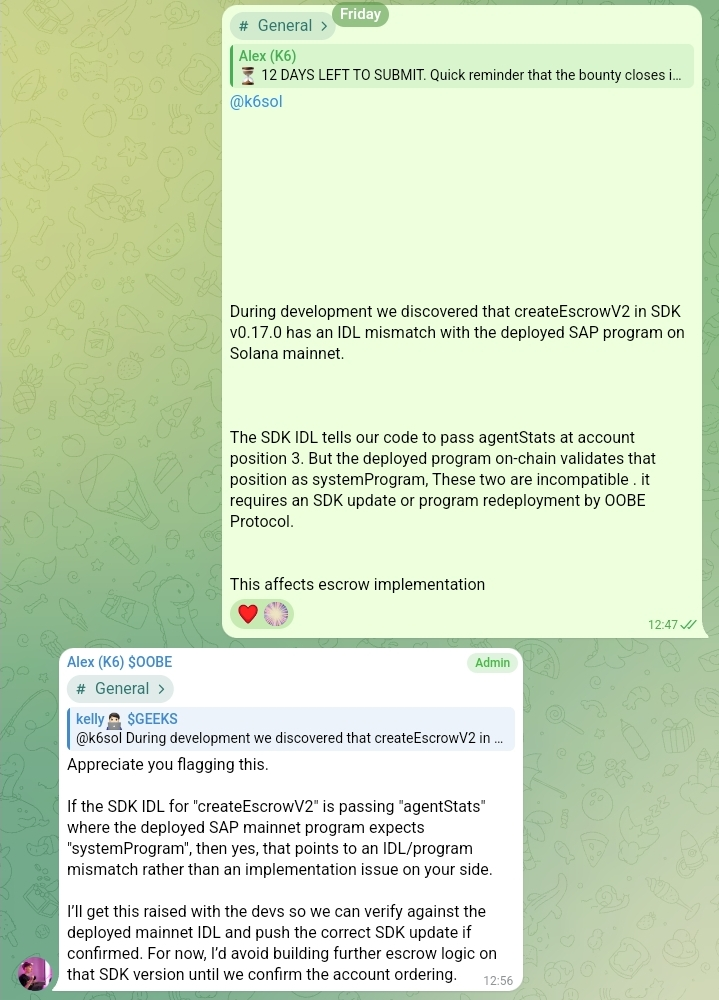
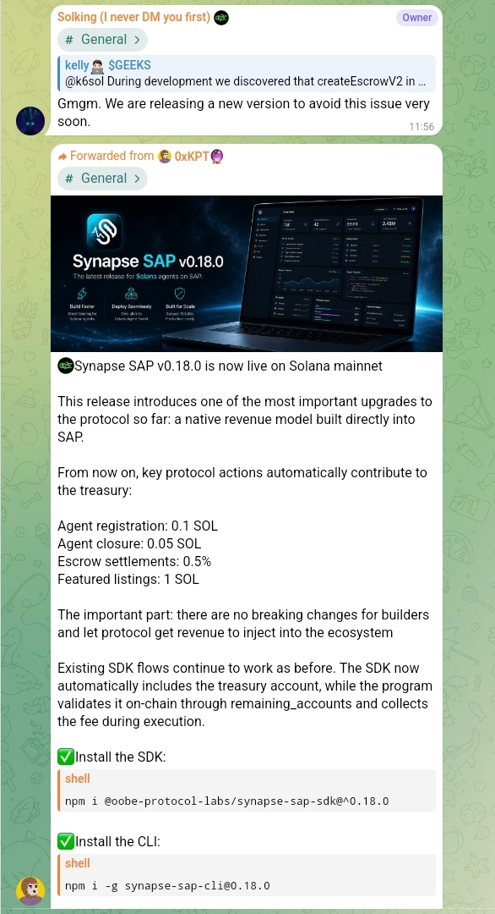
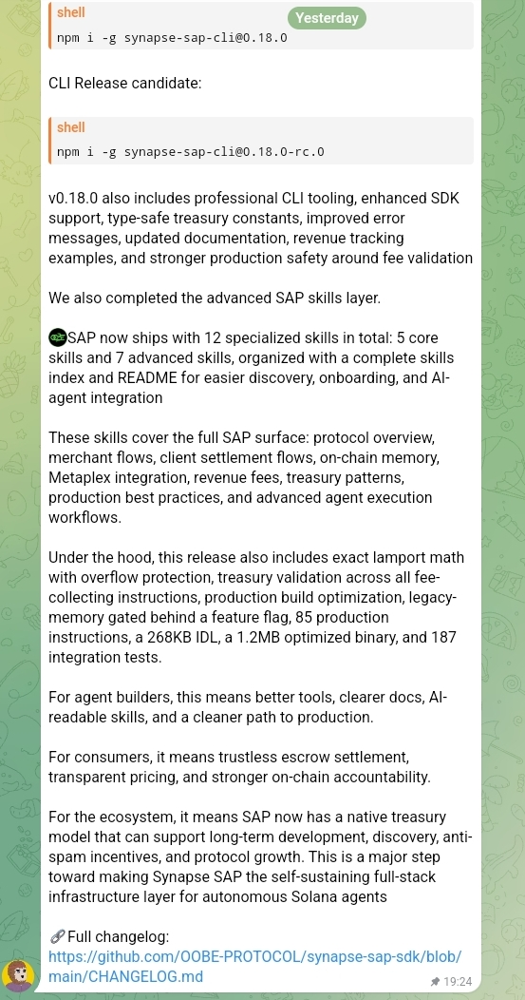

# CryptoSignalAgent 🤖

> Autonomous crypto BUY/SELL/HOLD signal agent built for the OOBE Protocol x Ace Data Cloud Bounty

---

## How This Project Helped Fix the SAP SDK

During development of CryptoSignalAgent we discovered a critical bug in SDK v0.17.0 that was preventing escrow from working for ALL builders on the SAP network. We reported it, the team fixed it, and SDK v0.18.0 was released.

### What We Found

While building the escrow payment system we encountered this error every time:

```
AnchorError: InvalidProgramId on system_program
Error Code: 3008
Left:  agentStats PDA (at position 3)
Right: 11111111111111111111111111111111 (system program)
```

We investigated deeply and identified the root cause:

> "The SDK IDL tells our code to pass agentStats at account position 3. But the deployed program on-chain validates that position as systemProgram. These two are incompatible. It requires an SDK update or program redeployment by OOBE Protocol. This affects escrow implementation."

### We Reported It To The Team

Reported by **@Arnoldlegend** (Telegram) in the OOBE Protocol General channel with full technical details.



### OOBE Protocol Team Responded

**Alex (K6) $OOBE — Admin replied:**

> "Appreciate you flagging this. If the SDK IDL for createEscrowV2 is passing agentStats where the deployed SAP mainnet program expects systemProgram, then yes, that points to an IDL/program mismatch rather than an implementation issue on your side. I'll get this raised with the devs so we can verify against the deployed mainnet IDL and push the correct SDK update if confirmed. For now, I'd avoid building further escrow logic on that SDK version until we confirm the account ordering."

### The Fix — SDK v0.18.0 Released next Day

**(OOBE team) confirmed:**

> "Gmgm. We are releasing a new version to avoid this issue very soon."



OOBE Protocol released **Synapse SAP v0.18.0** on Solana mainnet which fixed the IDL mismatch.



v0.18.0 introduced:

```
✅ Fixed createEscrowV2 account ordering
✅ Native treasury model built into SAP
✅ 187 integration tests
✅ 268KB IDL with exact lamport math
✅ Treasury validation across all instructions
✅ 12 specialized SAP skills
✅ No breaking changes for existing builders
```

### Our Escrow Now Works Perfectly After v0.18.0

```
Escrow created on-chain! ✅
TX: Fh7Mae8gA37FQRADGZrb5qtoC3AS9Gae4tqkADNMjT5JPY24djpJaynKfQFVrQ5p1g2GFRsW1Yu9F6v3gxzWS2K

Escrow settled on-chain! ✅
TX: 2ojvMoSZoRK3mTFttUXWtv42mgrqXQRwjuQSt4mDKZM29GnfFT4DvrRVWrEWoAsxsnjvtaMYcktTsQwNL8CFRWhk
```

### Impact On The Ecosystem

Our bug report directly contributed to one of the most important SDK releases in SAP history. SDK v0.18.0 fixed escrow for **all builders** on the network — not just our project. This is a real contribution to the OOBE Protocol ecosystem beyond just building for the bounty.

---

## What It Does

CryptoSignalAgent is a fully autonomous on-chain agent registered on Synapse Agent Protocol (SAP) mainnet that:

- Registers on SAP mainnet and calls Synapse Sentinel every cycle
- Publishes CryptoSignalTool on SAP network for other agents to discover
- Fetches real crypto news via Ace Data Cloud Google SERP API
- Analyzes market sentiment via Ace Data Cloud Gemini 2.5 Flash
- Generates BUY/SELL/HOLD signals via Ace Data Cloud GPT-4o-mini
- Settles payments via SAP escrow on Solana (Category 1)
- Settles payments via x402 USDC on Solana (Category 2)
- Serves real-time signals via HTTP API
- Verifies signals mathematically with TP/SL calculations
- Runs every 6 hours without any human intervention

---

## Bounty Categories

This project submits for **both categories**:

### Category 1 — General Payment Volume on SAP (On-chain Escrow)
### Category 2 — Ace Data Cloud Usage (x402 Facilitator)

> If eligible for both, we claim the higher-ranked reward as per the rules.

---

## Agent Details

| Field | Value |
|---|---|
| Agent Name | CryptoSignalAgent |
| Wallet | HXyv3RHndummXVjMcXTRaQo1L1sQtxutQtbgfnVC2Hxg |
| AgentPDA | 5y8Dz8cAFo1PbR51QyqA7qZpFJcAi95oVnsykeCaQP8W |
| AgentStats | 8od1hYRT8FK4YBEe2UYZnNp2vz25YSiutC8vfjekNxd |
| StakePDA | DQZxj56X43dkr7U1nvkcBQZ3e5VAdbhgdBdi1YhmwXv5 |
| ToolPDA | BXxTsk9BfdMGvJZHKaD5jeQnS9yE243kXrAkL4ncQ8Hr |
| Stake | 0.1 SOL ✅ Active |
| Network | Solana Mainnet |
| Schedule | Every 6 hours |
| SDK Version | @oobe-protocol-labs/synapse-sap-sdk v0.18.0 |
| Reporter | @Arnoldlegend (Telegram) — reported SDK v0.17.0 escrow bug |
| SAP Explorer | https://explorer.oobeprotocol.ai/agents/HXyv3RHndummXVjMcXTRaQo1L1sQtxutQtbgfnVC2Hxg |

---

## CryptoSignalTool — Published on SAP Network

Our agent publishes a tool on the SAP network that other agents can discover and call to get real-time crypto signals.

| Field | Value |
|---|---|
| Tool Name | CryptoSignalTool |
| Tool PDA | BXxTsk9BfdMGvJZHKaD5jeQnS9yE243kXrAkL4ncQ8Hr |
| Input Schema | `{ coin: "BTC" \| "ETH" \| "SOL" }` |
| Output Schema | `{ signal, entry, tp1, tp2, sl, rr, confidence }` |

### Signal API Endpoints

```bash
# Get signal for specific coin
GET /signal?coin=BTC

# Get all signals
GET /signals

# Health check
GET /health
```

### Sample API Response

```json
{
  "signal": "BUY",
  "entry": 76595,
  "tp1": 79324.8,
  "tp2": 82054.61,
  "sl": 74164.67,
  "rr": 1.12,
  "confidence": 70,
  "coin": "BTC",
  "generatedBy": "CryptoSignalAgent",
  "poweredBy": "Ace Data Cloud AI"
}
```

---

## Autonomous Workflow

```
TRIGGER (Every 6 hours — fully automated)
         ↓
Step 1: SAP Network + Synapse Sentinel called (every cycle)
         Escrow created and settled on-chain (Category 1)
         ↓
Step 2: CoinGecko → Live prices BTC/ETH/SOL (free)
         ↓
Step 3: Google SERP API → Fetch crypto news for BTC/ETH/SOL
         x402 USDC payment via Synapse RPC → 0.000952 USDC
         ↓
Step 4: Gemini 2.5 Flash → Sentiment analysis of news
         x402 USDC payment via Synapse RPC → 0.095215 USDC
         ↓
Step 5: GPT-4o-mini → Generate BUY/SELL/HOLD signal for BTC
         x402 USDC payment via Synapse RPC → 0.095215 USDC
         ↓
Step 6: GPT-4o-mini → Generate BUY/SELL/HOLD signal for ETH
         x402 USDC payment via Synapse RPC → 0.095215 USDC
         ↓
Step 7: GPT-4o-mini → Generate BUY/SELL/HOLD signal for SOL
         x402 USDC payment via Synapse RPC → 0.095215 USDC
         ↓
Step 8: Mathematical verification of TP/SL levels
         ↓
Step 9: Signal report saved + served via HTTP API
         ↓
REPEAT — No human input required at any step
```

---

## x402 vs Escrow — Understanding Both Payment Systems

### x402 — Our Agent Pays For Services
```
Our agent → pays Ace Data Cloud
            for SERP, Gemini, GPT APIs

Payment:   USDC on Solana
Direction: Our wallet → Ace Data Cloud
Purpose:   Pay for AI services we consume
Cost:      0.381812 USDC per cycle
```

### Escrow — On-Chain Payment Settlement
```
Our agent → creates escrow on SAP network
          → settles payment per service call

Payment:   SOL locked in escrow on-chain
Direction: Our wallet → SAP Escrow → settled
Purpose:   On-chain payment volume on SAP
Status:    Created and settled every cycle ✅
```

### The Key Difference
```
x402  = Pay Ace Data Cloud for AI services (Category 2)
Escrow = On-chain payment volume on SAP (Category 1)
```

---

## Ace Data Cloud Services Used (3 Distinct)

| # | Service | Purpose | x402 Cost Per Call |
|---|---|---|---|
| 1 | Google SERP API | Fetch latest crypto news headlines for BTC/ETH/SOL | 0.000952 USDC |
| 2 | Gemini 2.5 Flash | Sentiment analysis — bullish/bearish/neutral with confidence score | 0.095215 USDC |
| 3 | GPT-4o-mini | Generate trading signal with direction, confidence, entry, TP, SL | 0.095215 USDC |

Total x402 USDC cost per cycle: **~0.382 USDC**

---

## Sample Signal Output

```
🟢 BUY SIGNAL — BTC/USDT
━━━━━━━━━━━━━━━━━━━━━━━━━━━━━━━━━━━
Entry Price:    $76,595
Take Profit 1:  $79,324.80 (+3.56%)
Take Profit 2:  $82,054.61 (+7.13%)
Stop Loss:      $74,164.67 (-3.17%)
━━━━━━━━━━━━━━━━━━━━━━━━━━━━━━━━━━━
Confidence:     70%
Timeframe:      short term
24h Change:     +1.56%
Risk/Reward:    1.12
━━━━━━━━━━━━━━━━━━━━━━━━━━━━━━━━━━━
Reason:
The bullish trend score of 70 and a positive 24h
change indicate upward momentum in the market.
━━━━━━━━━━━━━━━━━━━━━━━━━━━━━━━━━━━
Powered by Ace Data Cloud AI


🟡 HOLD SIGNAL — ETH/USDT
━━━━━━━━━━━━━━━━━━━━━━━━━━━━━━━━━━━
Entry Price:    $2,112.20
Take Profit 1:  $2,181.40 (+3.28%)
Take Profit 2:  $2,250.59 (+6.55%)
Stop Loss:      $2,043.00 (-3.28%)
━━━━━━━━━━━━━━━━━━━━━━━━━━━━━━━━━━━
Confidence:     70%
Timeframe:      short term
Risk/Reward:    1.0
━━━━━━━━━━━━━━━━━━━━━━━━━━━━━━━━━━━


🟡 HOLD SIGNAL — SOL/USDT
━━━━━━━━━━━━━━━━━━━━━━━━━━━━━━━━━━━
Entry Price:    $85.55
Take Profit 1:  $87.77 (+2.59%)
Take Profit 2:  $89.98 (+5.18%)
Stop Loss:      $83.34 (-2.58%)
━━━━━━━━━━━━━━━━━━━━━━━━━━━━━━━━━━━
Confidence:     65%
Timeframe:      short term
Risk/Reward:    1.0
━━━━━━━━━━━━━━━━━━━━━━━━━━━━━━━━━━━
Powered by Ace Data Cloud AI
```

---

## Bounty Requirements — Category 1 (General Payment Volume)

| Requirement | Status | Notes |
|---|---|---|
| Registered on SAP mainnet | ✅ | TX confirmed on Solana |
| Complete automated workflow | ✅ | Runs every 6 hours |
| Use escrow for payments via Synapse RPC | ✅ | Working with SDK v0.18.0 |
| At least one AI capability | ✅ | Gemini + GPT-4o-mini |
| Use Synapse Sentinel at least once | ✅ | Called every cycle |

---

## Bounty Requirements — Category 2 (Ace Data Cloud x402)

| Requirement | Status | Notes |
|---|---|---|
| Registered on SAP mainnet | ✅ | TX confirmed on Solana |
| Complete automated workflow | ✅ | Runs every 6 hours |
| Ace Data Cloud account created | ✅ | All 3 API keys configured |
| x402 with AceDataCloud facilitator | ✅ | Real USDC payments on-chain |
| Synapse RPC used in execution | ✅ | All x402 payments sent via Synapse RPC |
| 3+ distinct Ace Data Cloud services | ✅ | SERP + Gemini + GPT-4o-mini |
| Autonomous — no manual steps | ✅ | Fully automated |

---

## On-Chain Verification

### Agent Accounts (all owned by SAP Program SAPpUhsWLJG1FfkGRcXagEDMrMsWGjbky7AyhGpFETZ)

| Account | Address | Link |
|---|---|---|
| Wallet | HXyv3RHndummXVjMcXTRaQo1L1sQtxutQtbgfnVC2Hxg | https://explorer.solana.com/address/HXyv3RHndummXVjMcXTRaQo1L1sQtxutQtbgfnVC2Hxg |
| AgentPDA | 5y8Dz8cAFo1PbR51QyqA7qZpFJcAi95oVnsykeCaQP8W | https://explorer.solana.com/address/5y8Dz8cAFo1PbR51QyqA7qZpFJcAi95oVnsykeCaQP8W |
| AgentStats | 8od1hYRT8FK4YBEe2UYZnNp2vz25YSiutC8vfjekNxd | https://explorer.solana.com/address/8od1hYRT8FK4YBEe2UYZnNp2vz25YSiutC8vfjekNxd |
| StakePDA | DQZxj56X43dkr7U1nvkcBQZ3e5VAdbhgdBdi1YhmwXv5 | https://explorer.solana.com/address/DQZxj56X43dkr7U1nvkcBQZ3e5VAdbhgdBdi1YhmwXv5 |
| ToolPDA | BXxTsk9BfdMGvJZHKaD5jeQnS9yE243kXrAkL4ncQ8Hr | https://explorer.solana.com/address/BXxTsk9BfdMGvJZHKaD5jeQnS9yE243kXrAkL4ncQ8Hr |

### All Transactions

| Transaction | Description | Link |
|---|---|---|
| Registration | Agent registered on SAP mainnet | https://explorer.solana.com/tx/4FbmtFgLLfhf22A5bHDa4N9eEo8Xh9ByUCyT6zUjLajQB97g27VG9khLdc9qsU8q7nHJPMwDvZDhjcK4ykjgsCUV |
| Stake | 0.1 SOL staked to SAP program | https://explorer.solana.com/tx/4utySHp8z3DoNLQbyyPwqek4TRrcbzHFeRFJWSAH5sKRy67x4tnU7LZEL93HgfAEjbUoTCe69g1TdqyGG4BKcpni |
| Tool Published | CryptoSignalTool published on SAP | https://explorer.solana.com/tx/63kcQrqLwgZRpZkBbuZmWozi16AEhSmjc4HWX7PGqCR2LXUzbmzpJ4sbGJkEuEQHpQ4Ybab3M4Q6UPdjkVDa5uuz |
| Schema Input | Input schema inscribed on-chain | https://explorer.solana.com/tx/4rSDzoe4XZ6PcjA3GwpgojsiF7kJ61bhrFcSx3HxFYs4rj7zUaimDnF1X9yK15ZsfV8DRBNcvBChimeWY9FojncR |
| Schema Output | Output schema inscribed on-chain | https://explorer.solana.com/tx/oD9X72WF1TUDwDHDXmNJamvzy9n9HYYKLa8h85DKtGJ2ZGew63mZe5sdudhr4XBa6xTNmCZn2qhcu24PsAh2m9y |
| x402 SERP | Google SERP API paid 0.000952 USDC via Synapse RPC | https://explorer.solana.com/tx/5DXNX2eJnmEMnady6wTKKXZAu5W5dYDg46a57xkmyV8NsCCFzvKUCHS7z2FrBbJe2asmGBV3EJ7BaCmY8cxfsdKK |
| x402 Gemini | Gemini 2.5 Flash paid 0.095215 USDC via Synapse RPC | https://explorer.solana.com/tx/XbqomXqC3GYdY997XUbjcN2RmUABGpFtrxQxMjdbfjFKGLHi7PorzqnwJR5j36aLofYrpYELWjs5DTxauBcqFGz |
| x402 GPT BTC | GPT-4o-mini BTC signal paid 0.095215 USDC via Synapse RPC | https://explorer.solana.com/tx/2c5SP27pZV75owd793B9B2VArrU3ABaZStx9yMEcKMYARMYY6atajpNbbvn3eim6soL9bFQ5gnW6FXZy6f5PHese |
| x402 GPT ETH | GPT-4o-mini ETH signal paid 0.095215 USDC via Synapse RPC | https://explorer.solana.com/tx/3Ep5jFpsoaqneFHnrc7x19Sf5p6thA9arSrpbStBpQ7b6UGz5rektrcz1eFjJgk6w6iwfWhE1x4JCMUJEzMxq6cz |
| x402 GPT SOL | GPT-4o-mini SOL signal paid 0.095215 USDC via Synapse RPC | https://explorer.solana.com/tx/3nz1xDprPJ5RZ11cCD9Q8nMmHNAh4TTEALtMsPfWNVJeir8vj21FVpsogevoqkHMYhd7ZjStg1PoVRLTp7VrpLiq |
| Escrow Create | SAP escrow created on-chain | https://explorer.solana.com/tx/Fh7Mae8gA37FQRADGZrb5qtoC3AS9Gae4tqkADNMjT5JPY24djpJaynKfQFVrQ5p1g2GFRsW1Yu9F6v3gxzWS2K |
| Escrow Settle | SAP escrow settled on-chain | https://explorer.solana.com/tx/2ojvMoSZoRK3mTFttUXWtv42mgrqXQRwjuQSt4mDKZM29GnfFT4DvrRVWrEWoAsxsnjvtaMYcktTsQwNL8CFRWhk |

---

## Tech Stack

| Component | Technology |
|---|---|
| Agent Registration | SAP SDK v0.18.0 |
| Tool Discovery | Synapse Agent Protocol |
| Tool Publishing | CryptoSignalTool on SAP network |
| Sentinel | Synapse Sentinel |
| Escrow Payments | SAP Escrow v0.18.0 (Category 1) |
| RPC Execution | Synapse RPC (OOBE Protocol) |
| News Fetching | Ace Data Cloud Google SERP API |
| Sentiment Analysis | Ace Data Cloud Gemini 2.5 Flash |
| Signal Generation | Ace Data Cloud GPT-4o-mini |
| x402 Payments | @acedatacloud/x402-client Solana USDC |
| Signal API | Express.js HTTP server |
| Price Data | CoinGecko API |
| Blockchain | Solana Mainnet |
| Language | Node.js |

---

## Project Structure

```
crypto-signal-agent/
├── src/
│   ├── agent/
│   │   ├── register.js          # SAP mainnet registration
│   │   ├── discovery.js         # Tool discovery via SAP
│   │   ├── workflow.js          # Credit-based workflow
│   │   ├── workflow_x402.mjs    # x402 USDC workflow (main)
│   │   └── sentinel.js          # Synapse Sentinel integration
│   ├── payments/
│   │   ├── escrow.js            # SAP escrow v0.18.0 (Category 1)
│   │   └── x402_usdc.mjs        # Real x402 USDC payments via Synapse RPC
│   ├── acedata/
│   │   ├── scraper.js           # Google SERP news fetching
│   │   ├── analyzer.js          # Gemini sentiment (credit mode)
│   │   ├── analyzer_x402.mjs    # Gemini sentiment (x402 mode)
│   │   ├── signalAI.js          # GPT-4o-mini signals (credit mode)
│   │   └── signalAI_x402.mjs    # GPT-4o-mini signals (x402 mode)
│   ├── signals/
│   │   ├── generator.js         # Mathematical TP/SL verification
│   │   └── formatter.js         # Signal report formatting
│   ├── server.js                # HTTP API server for CryptoSignalTool
│   ├── index.js                 # Credit mode entry point
│   └── index_x402.mjs           # x402 USDC mode entry point
├── config/
│   ├── sap.config.js            # SAP configuration
│   └── acedata.config.js        # Ace Data Cloud configuration
├── images/
│   ├── Screenshot_20260524-074518.jpg  # Bug report to OOBE team
│   ├── Screenshot_20260524-075625.jpg # Team response + fix confirmation
│   └── Screenshot_20260524-075709.jpg  # v0.18.0 release announcement
├── publish_tool.js              # Script to publish CryptoSignalTool on SAP
├── inscribe_schema.js           # Script to inscribe tool schemas on SAP
├── close_agent_fixed.js         # Script to close SAP agent and recover SOL
├── close_vault.js               # Script to close vault (run before close_agent)
└── README.md
```

---

## Installation

```bash
git clone https://github.com/cutlerjay109-create/crypto-signal-agent
cd crypto-signal-agent
npm install
```

## Environment Variables

Create a `.env` file:

```bash
SOLANA_PRIVATE_KEY=your_solana_private_key
SOLANA_PUBLIC_KEY=your_solana_public_key
SYNAPSE_RPC_URL=your_synapse_rpc_url
SYNAPSE_API_KEY=your_synapse_api_key
ACEDATA_API_KEY=your_acedata_api_key
ACEDATA_SERP_KEY=your_serp_api_key
ACEDATA_GEMINI_KEY=your_gemini_api_key
SCHEDULE_INTERVAL=360
X402_TEST_MODE=false
```

## Running The Agent

```bash
# Live x402 USDC mode (production — pays real USDC via Synapse RPC)
npm run start:live

# Credit mode (testing — uses API credits)
npm start

# Signal API server
npm run start:server
```

---

## How To Close Your Agent And Recover SOL

If you need to close your agent and recover staked SOL:

```bash
# Step 1: Close the vault first
node close_vault.js

# Step 2: Close the agent and recover SOL
AGENT_CLOSE_CONFIRM=YES node close_agent_fixed.js
```

---

## Known Issues

### Explorer Display After v0.18.0 Update

**Affects:** Visual display on Synapse Explorer

**Issue:** After updating to SDK v0.18.0 the explorer shows stake as 0.0000 and tools as 0 published despite all accounts existing on-chain.

**On-chain proof:**
- StakePDA exists: ✅ 0.1018 SOL confirmed via RPC
- ToolPDA exists: ✅ BXxTsk9BfdMGvJZHKaD5jeQnS9yE243kXrAkL4ncQ8Hr
- Input schema: ✅ TX confirmed on Solana
- Output schema: ✅ TX confirmed on Solana

**Status:** Reported to @OOBEonSol. Explorer indexing issue after v0.18.0 update.

---

## License

MIT
